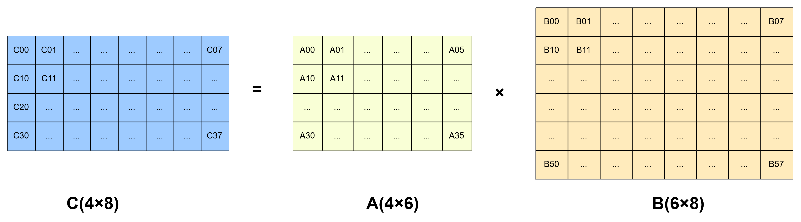
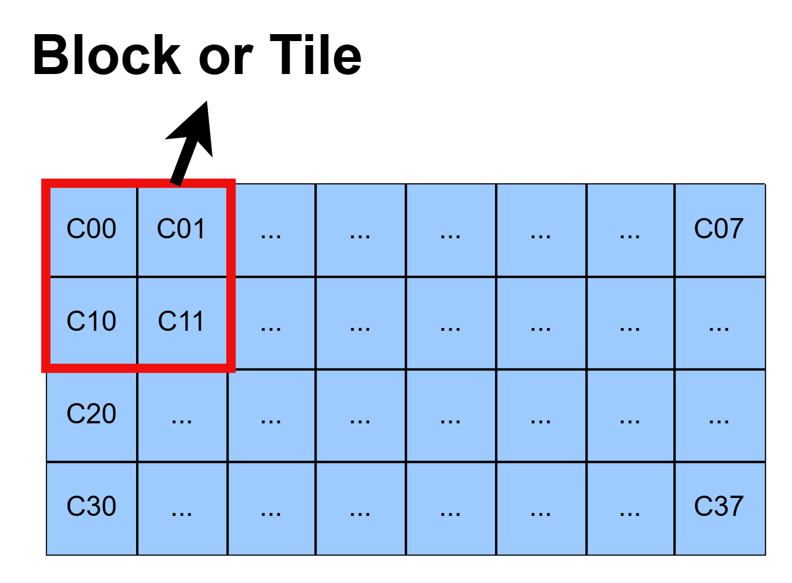
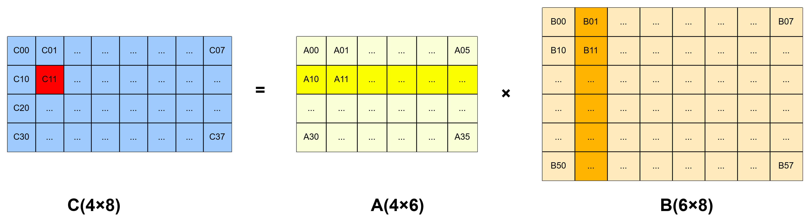
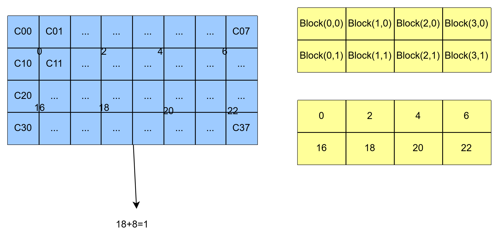

# GEMM 是什么？

---

通用矩阵乘法，标准形式：

$$
C = \alpha A×B + \beta C
$$

其中，$A=M×K$，$B=K×N$，$C=M×N$

在深度学习计算中，通常形式是：$C=A×B$，即：$\alpha = 1，\beta = 0$

# AI模型里面的GEMM

--- 

AI模型中含有大量的的GEMM，大约占了80%。
比如：
- TransFormer中单的自注意力机制，$QK^T$就是GEMM。
- 前馈FFN中，$WX_1$和$WX_2$也是GEMM。

因此，GEMM的计算速度直觉决定AI模型的推理速度。

# GEMM优化方法

---

主要有两类优化方法：

1) 基于算法分析的优化方法，在很早之前，就有人根据矩阵乘法计算特性，从数学角度优化，典型的算法包括`Strassen`算法和`Coppersmith-Winograd`算法。
2) 基于软件优化的方法：从计算机的线程层次和内存层次优化矩阵计算过程。

# CPU三重循环怎么写？

---

`C`的每个元素等于`A`的第`i`行与`B`的第`j`列的点积。

$$
C_{ij}=\sum_{k=0}^{K-1}A_{ik}·B_{kj}
$$

外层`i`行，中层`j`列，内层`k`求和。

## 一个具体的例子

设：
$$
A=\begin{bmatrix}
1 & 2 & 3 \\
4 & 5 & 6
\end{bmatrix},
B=\begin{bmatrix}
7 & 8 \\
9 & 10 \\
11 & 12
\end{bmatrix}
$$

`A`行访问连续、`B`列访问步长为`N`，不连续

# GPU线程层次理解

---

### 核心层级架构 (The CUDA Hierarchy)

1. **Kernel Launch (核函数启动) = 1 个 Grid**
当用 `<<< >>>` 语法调用一个核函数时，GPU 就会在底层创建一个 Grid。这个 Grid 包含了本次计算任务所需要的所有线程。
2. **1 个 Grid = 多个 Block (线程块)**
Grid 是一个逻辑上的大容器，它被划分为多个 Block。也就是代码里的 `dim3 grid(...)` 参数。
3. **1 个 Block = 多个 Thread (线程)**
每个 Block 内部又包含了多个 Thread，这就是具体干活的工人。也就是代码里的 `dim3 block(...)` 参数。

---

### 代码与概念的直接映射

矩阵乘法启动代码：

```cpp
dim3 block(16, 16);
dim3 grid((W + 15) / 16, (H + 15) / 16);

// 这一行代码执行时，就诞生了【1个 Grid】
MatrixMulTiled<<<grid, block>>>(A_d, B_d, C_d, H, W, K); 

```

当这行代码执行时，GPU 会发生以下事情：

* **诞生**：GPU 接收到命令，为 `MatrixMulTiled` 这个核函数生成了 **1 个完整的 Grid**。
* **分配**：这个 Grid 的大小和维度，完全由 `<<<grid, ...>>>` 里的第一个参数决定。
* **消亡**：当这个 Grid 里面的所有 Block、所有 Thread 都把计算任务跑完（比如矩阵乘法的所有元素都算完写回全局内存），这个 Kernel 就算执行完毕，**这个 Grid 也就随之消亡**。

### 关键延伸：如果调用多次 Kernel 呢？

注意区分“核函数代码”和“核函数启动”。

如果在 `main` 函数里写了一个 `for` 循环，把同一个 Kernel 连续调用了 5 次：

```cpp
for(int i=0; i<5; i++){
    MatrixMulTiled<<<grid, block>>>(...);
}

```

那么，GPU 实际上是按顺序创建了 **5 个独立的 Grid**（每次启动对应一个 Grid）。它们是相互隔离的执行批次，哪怕它们用的是同一段逻辑代码。


### 2D 线程索引

```cuda
int bx = blockIdx.x;    // 当前 block 在 grid 中的 x 坐标
int by = blockIdx.y;    // 当前 block 在 grid 中的 y 坐标
int tx = threadIdx.x;   // 当前线程在 block 中的 x 坐标
int ty = threadIdx.y;   // 当前线程在 block 中的 y 坐标
```

 `blockIdx.x * blockDim.x + threadIdx.x` 的**2D 版本**。2D/3D 组织方式。

```
Grid (10×10 blocks 的矩阵)         Block (32×32 threads)
┌─────────────────────────┐        ┌─────────────────────┐   
│ (0,0)  (1,0)  (2,0) ... │        │(0,0)(1,0)(2,0) ...  │   
│ (0,1)  (1,1)  (2,1) ... │        │(0,1)(1,1)(2,1) ...  │   
│ (0,2)  (1,2)  (2,2) ... │        │(0,2)(1,2)(2,2) ...  │   
│  ...    ...    ...      │        │ ...  ...  ...       │   
└─────────────────────────┘        └─────────────────────┘   
  每个 (bx, by) 定位一个 tile        每个 (tx, ty) 处理一个元素
```

# 普通Kernel计算弊端
---
1. 全局内存访问过于频繁这是主要弊端
- 重复读取：普通实现，计算矩阵中一个元素，会反复从全局内存中读取一个元素，会极度消耗内存带宽
- 内存带宽限制：GPU的计算能力远远高于内存带宽，因此这种方式会导致大量的计算可信闲置
2. 未能有效利用共享内存
3. 内存访问合并不理想
Warp内的线程访问的内存不连续

# 优化方向1：共享内存
---
全局内存的带宽远低于共享内存，对于这种一个元素被反复读取类型，更适合使用高内存带宽的共享内存。
怎么办呢？一个Block中的线程共享同一块内存（只是块内的线程共享，Block之间并不共享，但是我看最新的GPU支持块与块之间共享），因此可以考虑把矩阵中的一部分加载到共享内存中。

## 具体做法（以非方阵为例）


```
A: 4行 × 6列 (M=4, K=6)       B: 6行 × 8列 (K=6, N=8)       C: 4行 × 8列 (M=4, N=8)

wA = 6                         wB = 8

   A (4×6)                           B (6×8)                          C (4×8)
┌─────────────────────────┐    ┌───────────────────────────────┐    ┌───────────────────────────────┐
│  0   1   2   3   4   5  │    │  0   1   2   3   4   5   6   7│    │ C00 C01 C02 C03 C04 C05 C06 C07│
│  6   7   8   9  10  11  │    │  8   9  10  11  12  13  14  15│    │ C10 C11 C12 C13 C14 C15 C16 C17│
│ 12  13  14  15  16  17  │    │ 16  17  18  19  20  21  22  23│    │ C20 C21 C22 C23 C24 C25 C26 C27│
│ 18  19  20  21  22  23  │    │ 24  25  26  27  28  29  30  31│    │ C30 C31 C32 C33 C34 C35 C36 C37│
└─────────────────────────┘    │ 32  33  34  35  36  37  38  39│    └───────────────────────────────┘
                               │ 40  41  42  43  44  45  46  47│
                               └───────────────────────────────┘
```
> **关键：A的列数=B的行数=K=6**

### Grid布局
```
C（4×8），我把他切成BLOCK_SIZE=2的"块"。"块"这个概念现在被NVIDIA标准化，叫Tile。

列方向：N/BLOCK_SIZE = 8/2 = 4 个 Block 宽
行方向：M/BLOCK_SIZE = 4/2 = 2 个 Block 高
Grid = 4 × 2 = 8 个 Block

    ┌─────┬─────┬─────┬─────┐
    │(0,0)│(1,0)│(2,0)│(3,0)│  ← by=0，算 C 第 0~1 行
    ├─────┼─────┼─────┼─────┤
    │(0,1)│(1,1)│(2,1)│(3,1)│  ← by=1，算 C 第 2~3 行
    └─────┴─────┴─────┴─────┘
       ↑                 ↑
     bx=0               bx=3

bx：对应Block的 blockIdx.x
by：对应Block的 blockIdx.y
```


一个Block中有4个线程，因为我这里设置的BLOCK_SIZE=2，2×2=4。

### Block中的计算

---

现在任务划分很明确了：每个`Block`中的`Thread`单独计算一个`C`矩阵中的元素

即：
$$C_{i,j}=\sum_{k=0}^{K-1} A_{i,k} \times B_{k,j}$$



$$C11 = A10×B01+A11×B11+A12×B21+A13×B31+A14×B41+A15×B51$$

做了6次乘法和5次加法。

如图所示，可以明显的看到，计算`C`矩阵`i`,`j`位置元素的值，会用到`A`矩阵的第`i`行和`B`矩阵的第`j`列。以第一个`Block`为例，它的行列范围是`x[0-1];y[0-1]`，因此第一个`Block`会用到`A`矩阵中前两行的所有元素，`B`矩阵中前两列的所有元素。
那么就可以有一个很好的优化思路，把`A`矩阵前两行和`B`矩阵中前两列的所有元素提前放进`Block`共享内存不就行了吗？
对，是这样。
但是细心的人会发现，`Bolck(1,0)`,`Bolck(2,0)`,`Block(3,0)`都会用到`A`矩阵的前两行，难道每个`Bolck`都要访问一遍全局内存，然后把`A`中的前两行存在自己的共享内存当中吗？
对，是这样。
这是当前一个比较好的优化方案，尽管占用了更多的共享内存，但是大幅度减小了对全局内存带宽的依赖。上述问题，`NVIDIA`在硬件上已经做出了升级，引入了`GPC`的概念，它允许`Block`之间访问各自的共享内存，也就是说只用在全局内存中拷贝一遍就行，这个后面再讲。

#### Bolck(0,0)

```c
int bx = 0, by = 0;
int tx, ty;  // 0 或 1

int aBegin = K * BLOCK_SIZE * by = 6 * 2 * 0 = 0;
int aEnd   = aBegin + K - 1       = 0 + 6 - 1  = 5;   // A 第 0 行遍历到位置 5
int aStep  = BLOCK_SIZE           = 2;

int bBegin = BLOCK_SIZE * bx      = 2 * 0 = 0;
int bStep  = BLOCK_SIZE * N       = 2 * 8 = 16;         // ← 注意！这里用 N，不是 K！
```

**`bStep = BLOCK_SIZE × N`，不是 `× K`。** 这是关键。B 有 N=8 列，向下跳一行就是跳 8 个元素。

代码中 `wB` 就是 B 的宽度 = N。因为 B 按行存储，跳到下一行 = 跳过一整行 = N 个元素。

遍历次数=K/BLOCK_SIZE =6/2=3轮

A 和 B 在**公共维度 K** 上各切 3 段：

```
A 第 0 行（在 K 维度上滑动）          B 第 0 列（在 K 维度上滑动）

      K=6                                    K=6
  ┌─────┬─────┬─────┐                 ┌──┐
  │ 0  1│ 2  3│ 4  5│                 │ 0│  ← 第1轮（B 第0~1行）
  └─────┴─────┴─────┘                 │ 8│
    第1轮  第2轮  第3轮                ├──┤
                                      │16│  ← 第2轮（B 第2~3行）
                                      │24│
                                      ├──┤
                                      │32│  ← 第3轮（B 第4~5行）
                                      │40│
                                      └──┘
```
#### 逐轮计算
#### 第 1 轮：a=0, b=0

加载到共享内存：

```
As = A 行列 0~1：                Bs = B 行 0~1，列 0~1：
  ┌───────┐                        ┌───────┐
  │ 0   1 │                        │ 0   1 │
  ├───────┤                        ├───────┤
  │ 6   7 │                        │ 8   9 │
  └───────┘                        └───────┘
```

计算：

```
T(0,0)：Csub = 0×0 + 1×8     = 8        ← C00 的第 1 部分
T(1,0)：Csub = 0×1 + 1×9     = 9        ← C01 的第 1 部分
T(0,1)：Csub = 6×0 + 7×8     = 56       ← C10 的第 1 部分
T(1,1)：Csub = 6×1 + 7×9     = 69       ← C11 的第 1 部分
```

#### 第 2 轮：a=2, b=16

```
As = A 列 2~3：                 Bs = B 行 2~3，列 0~1：
  ┌───────┐                        ┌───────┐
  │ 2   3 │                        │16  17 │
  ├───────┤                        ├───────┤
  │ 8   9 │                        │24  25 │
  └───────┘                        └───────┘

T(0,0)：Csub = 8  + 2×16 + 3×24 = 8  + 32 + 72  = 112
T(1,0)：Csub = 9  + 2×17 + 3×25 = 9  + 34 + 75  = 118
T(0,1)：Csub = 56 + 8×16 + 9×24 = 56 + 128+ 216 = 400
T(1,1)：Csub = 69 + 8×17 + 9×25 = 69 + 136+ 225 = 430
```

#### 第 3 轮：a=4, b=32

```
As = A 列 4~5：                 Bs = B 行 4~5，列 0~1：
  ┌───────┐                        ┌───────┐
  │ 4   5 │                        │32  33 │
  ├───────┤                        ├───────┤
  │10  11 │                        │40  41 │
  └───────┘                        └───────┘

T(0,0)：Csub = 112 + 4×32 + 5×40 = 112 + 128 + 200 = 440   ← C00 最终值
T(1,0)：Csub = 118 + 4×33 + 5×41 = 118 + 132 + 205 = 455   ← C01 最终值
T(0,1)：Csub = 400 + 10×32+11×40 = 400 + 320 + 440 = 1160  ← C10 最终值
T(1,1)：Csub = 430 + 10×33+11×41 = 430 + 330 + 451 = 1211  ← C11 最终值
```

#### 结果写回



1. 先计算`Block`所在位置的初始位置，横向跨度为`BLOCK_SIZE`，纵向跨度为`wB*BLOCK_SZIE`
2. 其次计算该线程相对于`Block`初始位置的位置，纵深为`wB*ty`，横向跨度为`tx`

```c
int c = N * BLOCK_SIZE * by + BLOCK_SIZE * bx;
     = 8 * 2 * 0 + 2 * 0 = 0;

C[c + N*ty + tx] = Csub;

T(0,0)：C[0 + 8×0 + 0] = C[0] = 440    ← 第 0 行第 0 列 ✓
T(1,0)：C[0 + 8×0 + 1] = C[1] = 455    ← 第 0 行第 1 列 ✓
T(0,1)：C[0 + 8×1 + 0] = C[8] = 1160   ← 第 1 行第 0 列 ✓
T(1,1)：C[0 + 8×1 + 1] = C[9] = 1211   ← 第 1 行第 1 列 ✓
```

C 每行有 **N=8** 个元素，所以 C[0..7] 是第 0 行，C[8..15] 是第 1 行。


# 优化方向1：异步执行
---
当前的GPU处理方式如下图所示：
```
时间 →
──────────────────────────────────────────────────────
   cudaMemcpy(H→D)  │████████████│
                    等待……        │  ← GPU 闲着！
                    kernel       │██████│
                    等待……                │  ← CPU 闲着！
                    cudaMemcpy(D→H)       │████████████│
──────────────────────────────────────────────────────
```
GPU 等数据、CPU 等结果，**大量时间浪费在等待上**。如RTX 4090 的 PCIe 带宽约 32GB/s，而你处理 50000 个 float（200KB）时，传输时间远超计算时间。

## Stream：独立的命令队列


```
默认流 (Stream 0)               Stream 1              Stream 2
─────────────────          ─────────────────      ─────────────────
  kernel_0                    kernel_1              kernel_2
  memcpy_0                    memcpy_1              memcpy_2
```

- 同一个 Stream 内的操作**严格顺序执行**
- **不同 Stream 之间的操作可以并行**
- GPU 硬件会自动将不同 stream 的操作交错执行

**关键效果**：Stream 1 在做 kernel 时，Stream 2 可以同时做 memcpy，互不阻塞。


